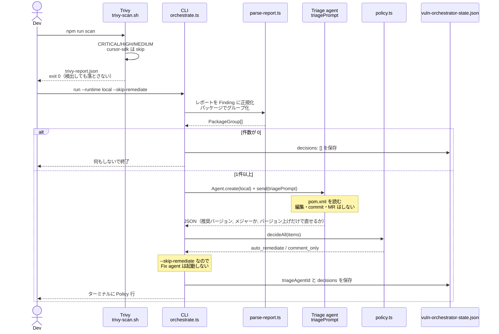
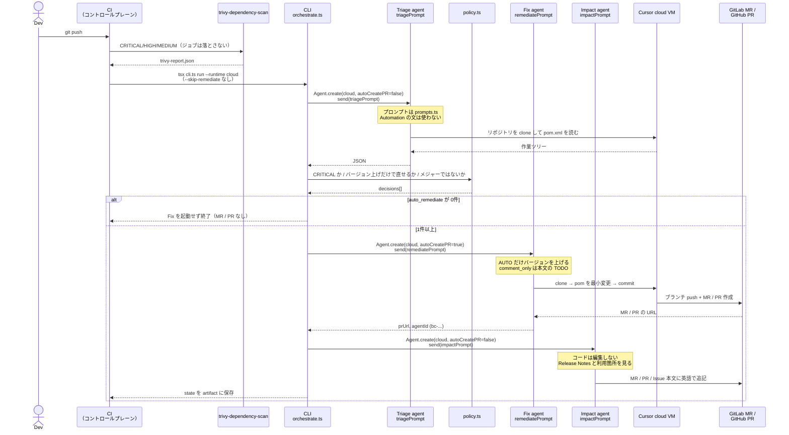
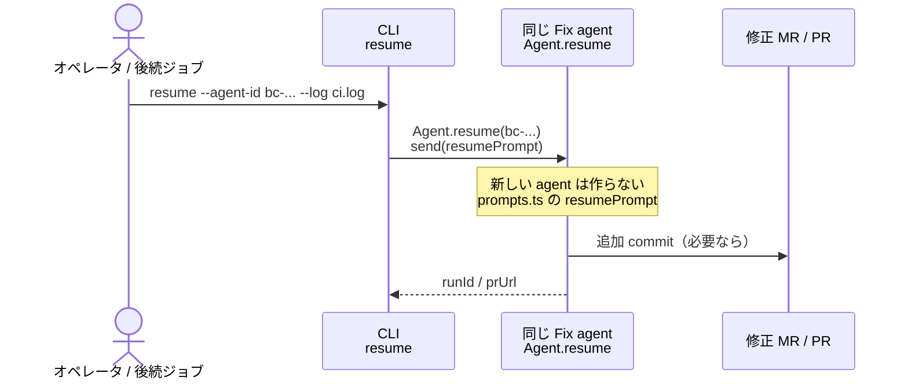
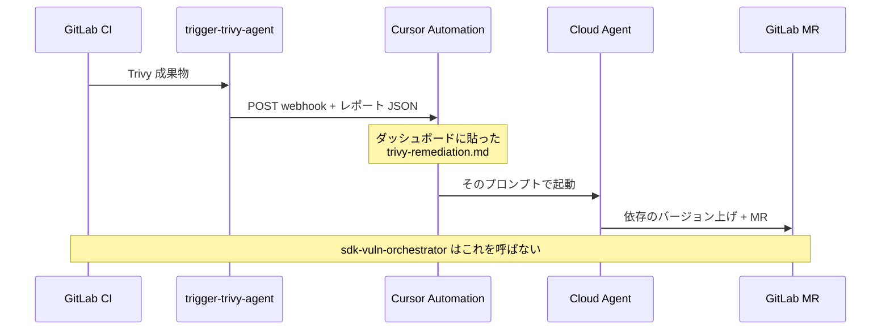
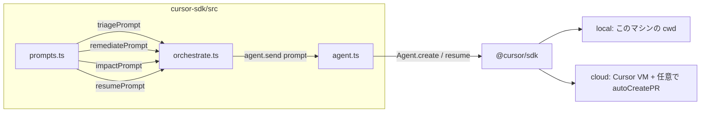

# 脆弱性オーケストレータ シーケンス

English: [SEQUENCE.md](./SEQUENCE.md)

使い方: [USAGE.ja.md](./USAGE.ja.md) / 構成: [ARCHITECTURE.ja.md](./ARCHITECTURE.ja.md)

プロンプトはすべて `src/prompts.ts` から `agent.send()` に渡します。Cursor Automation に貼った文は、この SDK 経路では使われません。

## 登場するもの

| 略称 | 実体 | SDK か |
| --- | --- | --- |
| Dev | 手元の開発者 | いいえ |
| Trivy | `scripts/trivy-scan.sh` または CI の `trivy-dependency-scan` | いいえ |
| CLI | `cli.ts` → `orchestrate.ts` | 呼び出し元 |
| Policy | `policy.ts` | いいえ |
| Triage | Cursor Agent（`triagePrompt`） | はい |
| Fix | Cursor Agent（`remediatePrompt`） | はい |
| Impact | Cursor Agent（`impactPrompt`） | はい |
| フォージ | GitLab（リポジトリ / MR）または GitHub（リポジトリ / PR） | いいえ |
| Automation | Cursor Automation + `trigger-trivy-agent` | いいえ（別経路） |

---

## 1. ローカル（MR は開かない）

推奨コマンド: `cd cursor-sdk && npm run scan:run`  
（`--runtime local --skip-remediate`）

このあと MR は開きません。`remediationAgentId` も書きません。

---

## 2. CI（Policy を通ったものだけ MR / PR）

人が `--runtime cloud` を叩く必要はありません。同じフローに入口が 3 つあります（アプリ側が呼ぶ `repo-scan.yml`、`fleet-governance.yml` の `scan` matrix ジョブ、アプリ側 `.gitlab-ci.yml` の `sdk-vuln-orchestrator`）。`host.ts` が clone URL・開始 ref・MR / PR の呼び方を差し替え、`ecosystem.ts` が Maven / Gradle / npm / Go / Python の更新ルールを差し替えます。

Policy の中身は次のすべてを満たすときだけ `auto_remediate` です。

1. 重大度が CRITICAL
2. バージョンを上げるだけで直せる（`recommendedVersion` あり）
3. メジャーバージョン上げではない（先頭の数字が上がらない）

MR / PR 本文は TypeScript が書いていません。`remediatePrompt` を読んだ Fix agent が書きます。影響分析は `impactPrompt` が **英語で MR / PR / Issue 本文に追記** します（コメントではない）。

---

## 3. 修正 MR / PR の CI が落ちたあと（resume）

元の Trivy ジョブが赤でも resume しません。対象は修正ブランチの build/test 失敗か、エージェント run の失敗です。

ローカルのトリアージだけ回した state には `remediationAgentId` が無いので、この経路には使えません。

---

## 4. 使っていない経路（Cursor Automation、GitLab のみ）

SDK ジョブとは別物です。`CURSOR_TRIVY_WEBHOOK_URL` が残っていると、こちらも動いて MR が二重になります。GitHub Actions には移植していません。この webhook ジョブは GitLab に Automation 向けの「CI 完了」トリガーが無いから存在するものです。

| 経路 | プロンプト | MR を開くか |
| --- | --- | --- |
| ローカル `scan:run` | `triagePrompt` のみ | 開かない |
| CI `sdk-vuln-orchestrator`（GitLab CI / GitHub Actions） | `triagePrompt` → 通れば `remediatePrompt` → `impactPrompt` | Policy 通過時だけ（影響分析は本文追記） |
| CI `trigger-trivy-agent` | Automation の markdown | Automation 側の設定次第 |

---

## プロンプトが渡る位置

