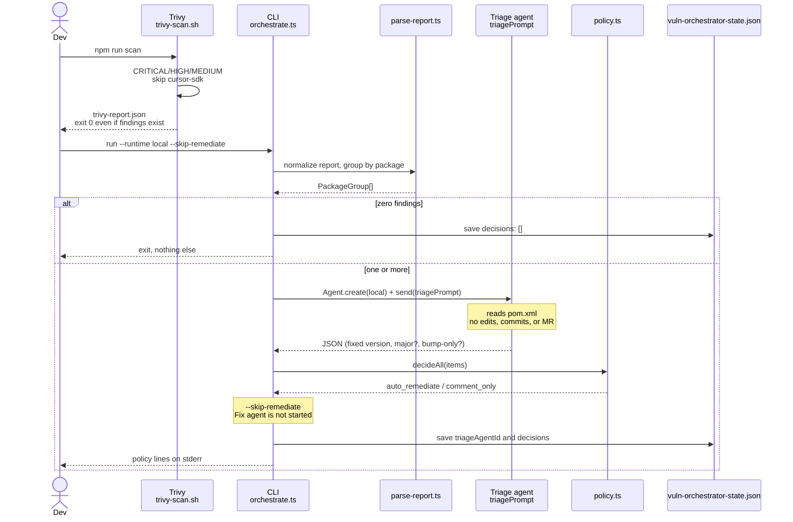
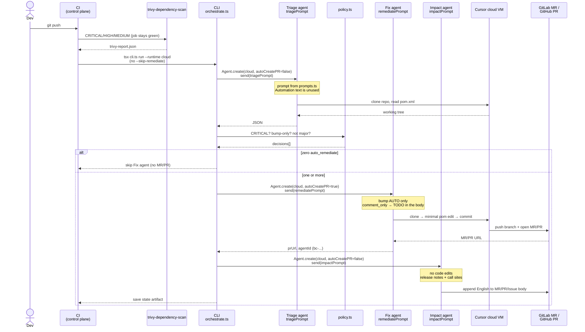
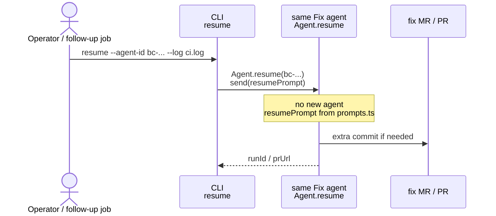
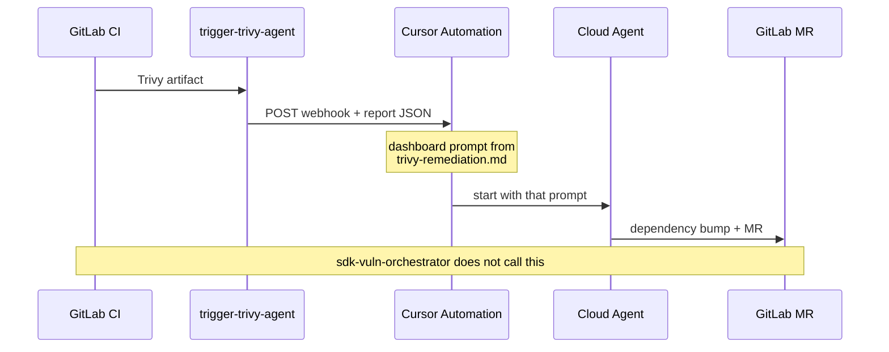
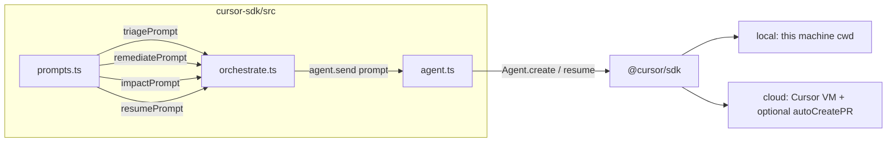

# Vulnerability orchestrator sequences

日本語: [SEQUENCE.ja.md](./SEQUENCE.ja.md)

Usage: [USAGE.md](./USAGE.md) / layout: [ARCHITECTURE.md](./ARCHITECTURE.md)

Every prompt is built in `src/prompts.ts` and passed to `agent.send()`. The text pasted into a Cursor Automation is not used on the SDK path.

## Participants

| Name | What it is | SDK? |
| --- | --- | --- |
| Dev | Developer on a laptop | no |
| Trivy | `scripts/trivy-scan.sh` or CI `trivy-dependency-scan` | no |
| CLI | `cli.ts` → `orchestrate.ts` | caller |
| Policy | `policy.ts` | no |
| Triage | Cursor agent (`triagePrompt`) | yes |
| Fix | Cursor agent (`remediatePrompt`) | yes |
| Impact | Cursor agent (`impactPrompt`) | yes |
| Forge | GitLab (repo / MR) or GitHub (repo / PR) | no |
| Automation | Cursor Automation + `trigger-trivy-agent` | no (separate path) |

---

## 1. Local (no MR)

Recommended: `cd cursor-sdk && npm run scan:run`  
(`--runtime local --skip-remediate`)

No MR is opened. `remediationAgentId` is not written.

---

## 2. CI (MR/PR only for packages that pass policy)

You do not pass `--runtime cloud` by hand. Three entry points run this same flow: `repo-scan.yml` called by an application repository, the `scan` matrix job in `fleet-governance.yml`, and `sdk-vuln-orchestrator` in an application repository's `.gitlab-ci.yml`. `host.ts` only swaps the clone URL, the starting ref, and the MR/PR wording; `ecosystem.ts` swaps the upgrade rules for Maven / Gradle / npm / Go / Python.

`auto_remediate` requires all of:

1. Severity is CRITICAL
2. A version bump alone is enough (`recommendedVersion` present)
3. Not a major bump (first numeric component does not increase)

The MR/PR body is not a TypeScript template. The Fix agent writes it from `remediatePrompt`. Impact analysis from `impactPrompt` is **appended in English to the MR/PR/Issue description**, not posted as a comment.

---

## 3. After the fix MR/PR's CI fails (resume)

Do not resume on a red Trivy job. Resume is for a failed build/test on the fix branch, or a failed agent run.

A local triage-only state file has no `remediationAgentId`, so it cannot drive this path.

---

## 4. Unused path (Cursor Automation, GitLab only)

This is separate from the SDK job. If `CURSOR_TRIVY_WEBHOOK_URL` is still set, both can run and duplicate MRs. It is not ported to GitHub Actions: the webhook job only exists because GitLab has no "CI completed" trigger for Automations.

| Path | Prompt | Opens an MR? |
| --- | --- | --- |
| Local `scan:run` | `triagePrompt` only | no |
| CI `sdk-vuln-orchestrator` (GitLab CI or GitHub Actions) | `triagePrompt` → `remediatePrompt` if allowed → `impactPrompt` | only on policy pass (impact is appended to the body) |
| CI `trigger-trivy-agent` | Automation markdown | whatever Automation is configured to do |

---

## Where prompts enter the SDK

